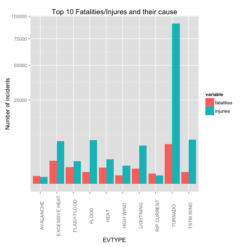
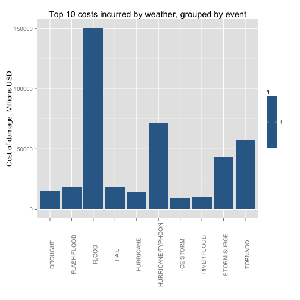

# Storm Consequence Analysis within US, 1950-2011


## Synopsis
In this report we aim to describe the impact of storm events in the United States between the years 1950 and 2011. The goal has been to identify key storm event types and their impact in terms of casualities/injuries and economic damage. To investigate this we obtained data from the U.S. National Oceanic and Atmospheric Administration's (NOAA) storm database which tracks characteristics of major storms and weather events in the United States, including when and where they occur, as well as estimates of any fatalities, injuries, and property damage. We found that tornados causes more causalties and injuries to human beings than any other kind of storm type. Tornados are also a significant contributor in overall economic damage. The main economic damage stems from floods. 


## Data Processing
Loading libraries + raw data + removing REMARKS for less data crunching. 

```r
library("R.utils")
library("data.table")
library("ggplot2")
library("reshape2")

# uncomment if bz2 is already unpacked
# bunzip2('repdata-data-StormData.csv.bz2')

stormTemp <- read.csv("repdata-data-StormData.csv")
stormTemp$REMARKS <- ""
stormData <- as.data.table(stormTemp)
```

Converting the property and crop damage exponential and applying it in order to attain the actual property damage. Not clearly documented so assumptions on the abbrevations were made (see code for more detail).

```r
knitrbug <- stormData[as.character(PROPDMGEXP) == "B", `:=`(PROPDMGEXP, "9")]
knitrbug <- stormData[as.character(PROPDMGEXP) == "m", `:=`(PROPDMGEXP, "6")]
knitrbug <- stormData[as.character(PROPDMGEXP) == "M", `:=`(PROPDMGEXP, "6")]
knitrbug <- stormData[as.character(PROPDMGEXP) == "k", `:=`(PROPDMGEXP, "3")]
knitrbug <- stormData[as.character(PROPDMGEXP) == "K", `:=`(PROPDMGEXP, "3")]
knitrbug <- stormData[as.character(PROPDMGEXP) == "h", `:=`(PROPDMGEXP, "2")]
knitrbug <- stormData[as.character(PROPDMGEXP) == "H", `:=`(PROPDMGEXP, "2")]
knitrbug <- stormData[as.character(PROPDMGEXP) == "-", `:=`(PROPDMGEXP, "0")]
knitrbug <- stormData[as.character(PROPDMGEXP) == "?", `:=`(PROPDMGEXP, "0")]
knitrbug <- stormData[as.character(PROPDMGEXP) == "+", `:=`(PROPDMGEXP, "0")]
knitrbug <- stormData[as.character(CROPDMGEXP) == "B", `:=`(CROPDMGEXP, "9")]
knitrbug <- stormData[as.character(CROPDMGEXP) == "m", `:=`(CROPDMGEXP, "6")]
knitrbug <- stormData[as.character(CROPDMGEXP) == "M", `:=`(CROPDMGEXP, "6")]
knitrbug <- stormData[as.character(CROPDMGEXP) == "k", `:=`(CROPDMGEXP, "3")]
knitrbug <- stormData[as.character(CROPDMGEXP) == "K", `:=`(CROPDMGEXP, "3")]
knitrbug <- stormData[as.character(CROPDMGEXP) == "?", `:=`(CROPDMGEXP, "0")]
knitrbug <- stormData[as.character(CROPDMGEXP) == "0", `:=`(CROPDMGEXP, "0")]

knitrbug <- stormData[, `:=`(CROPDMGEXP, as.integer(as.character(CROPDMGEXP)))]
knitrbug <- stormData[, `:=`(CROPDMG, CROPDMG * 10^CROPDMGEXP)]

knitrbug <- stormData[, `:=`(PROPDMGEXP, as.integer(as.character(PROPDMGEXP)))]
knitrbug <- stormData[, `:=`(PROPDMG, PROPDMG * 10^PROPDMGEXP)]
knitrbug <- stormData[is.na(PROPDMG), `:=`(PROPDMG, 0)]
knitrbug <- stormData[is.na(CROPDMG), `:=`(CROPDMG, 0)]

knitrbug <- stormData[, `:=`(TOTDMG, PROPDMG + CROPDMG)]
```


## Results
*Across the United States, which types of events (as indicated in the EVTYPE variable) are most harmful with respect to population health?*

Defining most harmful as number of deaths as the primary indicator and injuries as the secondary

```r
a <- stormData[, j = list(fatalities = sum(FATALITIES), injuries = sum(INJURIES)), 
    by = EVTYPE][order(-fatalities, -injuries), ][1:10]
a <- melt(a, id.vars = "EVTYPE")
ggplot(a, aes(EVTYPE, value, fill = variable)) + geom_bar(position = "dodge") + 
    scale_y_sqrt("Number of incidents") + theme(axis.text.x = element_text(angle = 90)) + 
    ggtitle("Top 10 Fatalities/Injures and their cause")
```

 

```r

```

Tornados are overall the main cause of both fatalities and injuries.

*Across the United States, which types of events have the greatest economic consequences?*


```r
b <- stormData[, j = list(TOTDMG = sum(TOTDMG)), by = EVTYPE][order(-TOTDMG), 
    ][1:10, ]
qplot(EVTYPE, TOTDMG/1e+06, data = b, geom = "bar", fill = 1, ylab = "Cost of damage, Millions USD", 
    xlab = "") + ggtitle("Top 10 costs incurred by weather, grouped by event") + 
    theme(axis.text.x = element_text(angle = 90))
```

 


Floods leads to more damage than any other weather events. However, it should be noted that tornadoes, hurricanes/typhoons and storm surges significantly contribute to the damage. 
